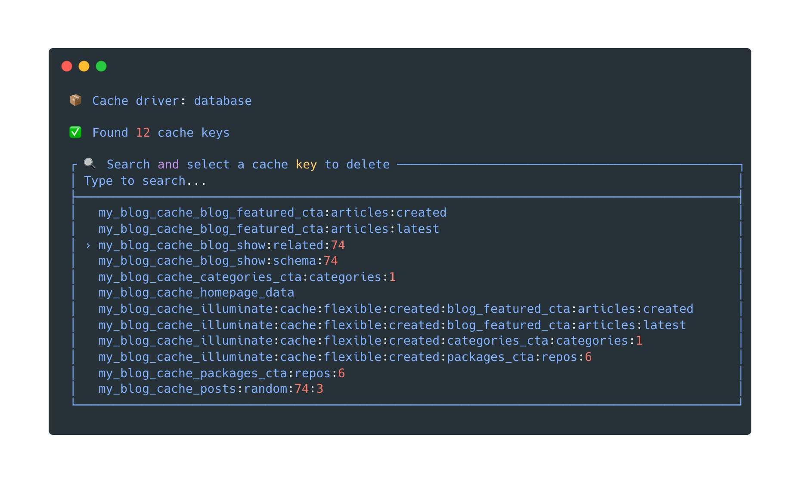

<picture>

</picture>

# Cache UI Laravel

[](https://packagist.org/packages/abr4xas/cache-ui-laravel)
[](https://github.com/abr4xas/cache-ui-laravel/actions?query=workflow%3Arun-tests+branch%3Amaster)
[](https://github.com/abr4xas/cache-ui-laravel/actions?query=workflow%3A"Fix+PHP+code+style+issues"+branch%3Amaster)
[](https://packagist.org/packages/abr4xas/cache-ui-laravel)

A Laravel package that allows you to list, search and delete individual cache keys without having to purge the entire cache. Supports multiple cache drivers (Redis, File, Database) with an interactive command line interface.

## Installation

You can install the package via composer:

```bash
composer require abr4xas/cache-ui-laravel
```

Optionally, you can publish the config file with:

```bash
php artisan vendor:publish --tag="cache-ui-laravel-config"
```

### Configuration

After publishing the config file, you can customize the package behavior:

```php
return [
    // Default cache store to use
    'default_store' => env('CACHE_UI_DEFAULT_STORE', null),

    // Character limit in value preview
    'preview_limit' => env('CACHE_UI_PREVIEW_LIMIT', 100),

    // Number of visible items in scroll
    'search_scroll' => env('CACHE_UI_SEARCH_SCROLL', 15),

    // Maximum number of keys to retrieve (null = unlimited)
    'keys_limit' => env('CACHE_UI_KEYS_LIMIT', null),

    // Enable error logging for cache operations
    'enable_logging' => env('CACHE_UI_ENABLE_LOGGING', false),

    // Timeout in seconds for cache operations (0 = no timeout)
    'operation_timeout' => env('CACHE_UI_OPERATION_TIMEOUT', 0),

    // Hide Laravel's internal cache keys (e.g. Cache::flexible() bookkeeping)
    'hide_internal_keys' => env('CACHE_UI_HIDE_INTERNAL_KEYS', true),
];
```

You can also configure these values in your `.env` file:

```env
CACHE_UI_DEFAULT_STORE=redis
CACHE_UI_PREVIEW_LIMIT=150
CACHE_UI_SEARCH_SCROLL=20
CACHE_UI_KEYS_LIMIT=1000
CACHE_UI_ENABLE_LOGGING=true
CACHE_UI_OPERATION_TIMEOUT=30
CACHE_UI_HIDE_INTERNAL_KEYS=true
```

### Custom File Cache Driver (Only for File Store)

If you are using the `file` cache driver, you should use our custom `key-aware-file` driver.

**Why?** The standard Laravel `file` driver stores keys as hashes, making them unreadable. This custom driver wraps the value to store the real key, allowing you to see and search for them.

> [!IMPORTANT]
> This is **NOT** needed for Redis or Database drivers, as they support listing keys natively. As of Laravel 11+, the default cache driver is `database`, so you only need this if you explicitly use the file store.

#### Driver Configuration

The `key-aware-file` driver is **registered automatically** by the package's service provider — there is no longer any need to call `Cache::extend()` in your `AppServiceProvider`. Just point your file store at the driver in `config/cache.php`:

```php
// ... existing code ...

    'stores' => [

        // ... existing stores ...

        'file' => [
            'driver' => 'key-aware-file', // Changed from 'file' to 'key-aware-file'
            'path' => storage_path('framework/cache/data'),
            'lock_path' => storage_path('framework/cache/data'),
        ],

// ... existing code ...
```

That's it. The package registers the driver inside an application `booting` callback, so it is available before any other service provider tries to read from the cache.

> [!NOTE]
> Upgrading from a previous version? You can safely **delete** the manual `Cache::extend('key-aware-file', ...)` block from your `AppServiceProvider` — the package now handles it for you.

#### Custom Driver Benefits

- ✅ **Readable keys**: Shows real keys instead of file hashes
- ✅ **Full compatibility**: Works exactly like the standard `file` driver
- ✅ **Better experience**: Enables more intuitive cache key search and management
- ✅ **Backward compatibility**: Existing cache files continue to work
- ✅ **Complete API**: Extends Laravel's `FileStore`, so every cache method works as usual. It overrides the store-level methods that need the key-wrapping (`put`, `get`, `add`, `forever`, `touch`, `increment`, `decrement`, `flush`); higher-level helpers such as `remember`, `rememberForever`, `pull`, `has` and `Cache::flexible()` work on top of those out of the box.

#### Migration from Standard File Driver

If you already have cached data with the standard `file` driver, don't worry. The `key-aware-file` driver is fully compatible and:

- Existing data will continue to work normally
- New keys will be stored in the new format
- You can migrate gradually without data loss


## Usage

### Basic Command

Run the command to list and manage cache keys:

```bash
php artisan cache:list
```

### Specify a Cache Store

If you have multiple cache stores configured, you can specify which one to use:

```bash
php artisan cache:list --store=redis
```

### Features

- 🔍 **Interactive search**: Search cache keys by typing text
- 📋 **List all keys**: View all available keys in your cache
- 🗑️ **Selective deletion**: Delete individual keys without affecting the rest of the cache
- 🔌 **Multiple drivers**: Supports Redis, File and Database
- ⚡ **Performance optimized**: Uses SCAN for Redis (safe for production) and supports key limits
- 📊 **Additional info**: View cache value, size, expiration, and type
- 📤 **Export functionality**: Export key lists to files
- 🔎 **Pattern filtering**: Filter keys using regex patterns
- 🧹 **Clean listings**: Hides Laravel's internal keys (e.g. `Cache::flexible()` bookkeeping) by default
- 🛡️ **Error handling**: Comprehensive error handling with optional logging

### Supported Drivers

| Driver | Support | Configuration Required |
|--------|---------|------------------------|
| **Redis** | ✅ Native | None (Works out of the box) |
| **Database** | ✅ Native | None (Works out of the box) |
| **File** | ✅ Enhanced | **Requires `key-aware-file` driver** |
| **Storage** | 🛠️ Planned | Not yet supported (see note below) |
| **Array** | ⚠️ No | Not supported (doesn't persist) |
| **Memcached** | ⚠️ No | Not currently supported |

> [!WARNING]
> The `key-aware-file` driver is **only** needed if you use the `file` cache driver. If you use Redis or Database, you don't need to change your driver configuration.

> [!NOTE]
> **`storage` driver (Laravel):** the `storage` cache driver persists entries on a filesystem disk (local, S3, …) using the **same SHA1-hashed file format as the `file` driver**, so keys are not human-readable out of the box. Supporting it well would mean replicating the key-aware approach (a `KeyAwareStorageStore`) over an arbitrary — possibly remote — disk. This is tracked as a future enhancement; for now, use Redis, Database, or the `key-aware-file` driver for readable key listings.

### Usage Example

```bash
$ php artisan cache:list

📦 Cache driver: redis
✅ Found 23 cache keys

🔍 Search and select a cache key to delete
> user_1_profile

📝 Key:     user_1_profile

Are you sure you want to delete this cache key? › No / Yes

🗑️  The key 'user_1_profile' has been successfully deleted
```

### Advanced Command Options

The command supports several useful options:

```bash
# Show cache value before deletion
php artisan cache:list --show-value

# Export keys list to a file
php artisan cache:list --export=keys.txt

# Filter keys by regex pattern
php artisan cache:list --filter="/^user_/"

# Show additional information (size, type, expiration)
php artisan cache:list --info

# Limit number of keys displayed (useful for large caches)
php artisan cache:list --limit=50

# Combine multiple options
php artisan cache:list --store=redis --show-value --info --limit=100
```

#### Option Details

- **`--store=`**: Specify which cache store to use (defaults to Laravel's default cache store)
- **`--show-value`**: Display the cache value before confirming deletion
- **`--export=`**: Export the list of keys to a file (one key per line)
- **`--filter=`**: Filter keys using a regex pattern (e.g., `/^user_/` matches keys starting with "user_")
- **`--info`**: Show additional information about each key (size, expiration time, data type)
- **`--limit=`**: Limit the number of keys to retrieve and display (helps with performance on large caches)

### Programmatic Usage

You can also use the `CacheUiLaravel` class directly in your code:

```php
use Abr4xas\CacheUiLaravel\Facades\CacheUiLaravel;

// Get all cache keys from default store
$keys = CacheUiLaravel::getAllKeys();

// Get all cache keys from a specific store
$redisKeys = CacheUiLaravel::getAllKeys('redis');

// Get limited number of keys (useful for large caches)
$limitedKeys = CacheUiLaravel::getAllKeys('redis', 100);

// Delete a specific key from default store
$deleted = CacheUiLaravel::forgetKey('user_1_profile');

// Delete a key from a specific store
$deleted = CacheUiLaravel::forgetKey('session_data', 'redis');

// The methods include validation:
// - Empty or invalid store names will use the default store
// - Empty keys will return false
// - Non-existent stores will throw an exception (if logging is enabled, errors are logged)
```

### Advanced Use Cases

#### Batch Operations

```php
use Abr4xas\CacheUiLaravel\Facades\CacheUiLaravel;

// Get all keys matching a pattern
$allKeys = CacheUiLaravel::getAllKeys('redis');
$userKeys = array_filter($allKeys, fn($key) => str_starts_with($key, 'user_'));

// Delete multiple keys
foreach ($userKeys as $key) {
    CacheUiLaravel::forgetKey($key, 'redis');
}
```

#### Monitoring Cache Size

```php
use Abr4xas\CacheUiLaravel\Facades\CacheUiLaravel;
use Illuminate\Support\Facades\Cache;

// Use limit parameter for better performance on large caches
$keys = CacheUiLaravel::getAllKeys('redis', 1000);
$totalSize = 0;

foreach ($keys as $key) {
    $value = Cache::get($key);
    if ($value !== null) {
        $totalSize += strlen(serialize($value));
    }
}

echo "Total cache size: " . number_format($totalSize / 1024 / 1024, 2) . " MB";
```

#### Error Handling and Logging

The package includes comprehensive error handling. You can enable logging to track cache operation errors:

```php
// In config/cache-ui-laravel.php or .env
'enable_logging' => true,

// Errors will be logged to Laravel's log file
// Example log entry:
// [2024-01-01 12:00:00] local.WARNING: Cache UI: Failed to retrieve keys from store 'redis': Connection timeout
```

When logging is enabled, the following operations will log errors:
- Key retrieval failures
- Key deletion failures
- Driver-specific errors (Redis connection, file system, database)

#### Cache Key Analysis

```php
use Abr4xas\CacheUiLaravel\Facades\CacheUiLaravel;

$keys = CacheUiLaravel::getAllKeys('redis');
$patterns = [];

foreach ($keys as $key) {
    $prefix = explode('_', $key)[0] ?? 'unknown';
    $patterns[$prefix] = ($patterns[$prefix] ?? 0) + 1;
}

arsort($patterns);
print_r($patterns); // Shows key distribution by prefix
```

#### Performance Optimization

For large caches, always use the `limit` parameter to improve performance:

```php
use Abr4xas\CacheUiLaravel\Facades\CacheUiLaravel;

// Get first 100 keys (useful for pagination)
$firstBatch = CacheUiLaravel::getAllKeys('redis', 100);

// Process in batches with pagination
$offset = 0;
$limit = 100;
do {
    $keys = CacheUiLaravel::getAllKeys('redis', $limit, $offset);
    // Process keys...
    $offset += $limit;
} while (count($keys) === $limit);
```

**Note**: The package automatically uses `SCAN` for Redis instead of `KEYS *`, which is safer for production environments as it doesn't block the Redis server.

## Internal Keys & `Cache::flexible()`

Laravel's [`Cache::flexible()`](https://laravel.com/docs/13.x/cache#swr) (stale-while-revalidate) stores **two** entries per key: your value, plus a companion timestamp under `illuminate:cache:flexible:created:<key>` that it uses to decide whether the value is fresh or stale.

That companion entry lives in the same keyspace as your data, so it would otherwise show up in the listing as noise. By default the package hides these internal bookkeeping keys:

```php
use Abr4xas\CacheUiLaravel\Facades\CacheUiLaravel;
use Illuminate\Support\Facades\Cache;

Cache::flexible('users', [5, 10], fn () => User::all());

CacheUiLaravel::getAllKeys();
// ['users']  ← the "illuminate:cache:flexible:created:users" companion is hidden
```

If you want to inspect those internal keys too (for example while debugging `flexible()` itself), disable the behavior:

```php
// config/cache-ui-laravel.php
'hide_internal_keys' => false,
```

```php
CacheUiLaravel::getAllKeys();
// ['users', 'illuminate:cache:flexible:created:users']
```

> [!NOTE]
> When `hide_internal_keys` is enabled, `--limit` / `keys_limit` behave as a **soft cap**, since internal keys are filtered out *after* they are fetched from the driver.

## Testing

Run the full quality suite (refactor check, lint, static analysis and tests):

```bash
# Run everything: Rector (dry-run) + Pint + PHPStan + Pest
composer test

# Or run each step individually
composer test:refactor   # Rector dry-run
composer test:lint       # Pint code style check
composer test:types      # PHPStan (level 6, via Larastan)
composer test:unit       # Pest test suite

# Run a specific test file
vendor/bin/pest tests/Unit/CacheUiLaravelMethodsTest.php

# Run with coverage
vendor/bin/pest --coverage
```

The package includes comprehensive test coverage:
- **Unit tests**: Individual component testing
- **Integration tests**: End-to-end workflow testing
- **Edge case tests**: Error handling and boundary conditions

Static analysis runs at **PHPStan level 6** with [Larastan](https://github.com/larastan/larastan) for Laravel-aware type checking. The configuration lives in `phpstan.neon.dist`.

## Technical Details

### Performance Optimizations

The package includes several performance optimizations:

1. **Redis SCAN**: Uses `SCAN` instead of `KEYS *` to prevent blocking Redis in production
2. **Key Limits**: Optional limit parameters for all drivers to avoid loading all keys at once
3. **Early Termination**: File driver stops reading files once the limit is reached
4. **Efficient Queries**: Database driver uses optimized queries with limits

### Error Handling

The package includes comprehensive error handling:

- **Validation**: Input validation for store names and cache keys
- **Graceful Degradation**: Falls back to alternative methods when primary methods fail
- **Logging**: Optional error logging via Laravel's Log facade
- **Exception Handling**: Catches and handles driver-specific exceptions

### KeyAwareFileStore Methods

The `key-aware-file` driver extends Laravel's `FileStore` and overrides the **store-level** methods that need to wrap/unwrap the real key:

- `put($key, $value, $seconds)` - Store an item with expiration
- `get($key, $default = null)` - Retrieve an item
- `add($key, $value, $seconds)` - Store an item only if it doesn't exist
- `forever($key, $value)` - Store an item permanently
- `touch($key, $seconds)` - Extend an existing item's TTL
- `increment($key, $value = 1)` - Increment a numeric value
- `decrement($key, $value = 1)` - Decrement a numeric value
- `forget($key)` - Delete an item
- `flush()` - Clear all items

Higher-level helpers (`remember`, `rememberForever`, `pull`, `has`, `Cache::flexible()`, …) live on Laravel's cache `Repository`, which wraps the store and calls `get`/`put` internally — so they all work transparently on top of the methods above without needing dedicated overrides.

## TODO

The following tests and improvements are planned or in progress:

### Unit Tests for KeyAwareFileStore
- [x] Test `put()` method with various data types (string, integer, array, boolean, null)
- [x] Test `get()` method with wrapped and unwrapped data formats
- [x] Test `add()` method behavior and return values
- [x] Test `forever()` method with zero expiration
- [x] Test `increment()` method with numeric values
- [x] Test `decrement()` method with numeric values
- [x] Test backward compatibility with legacy cache files
- [x] Test error handling for corrupted cache files
- [x] Test file permissions and directory creation
- [x] Test `touch()` and `flush()` methods

### Integration Tests
- [x] Test complete cache workflow (store → retrieve → delete)
- [x] Test multiple keys with different expiration times
- [x] Test cache key listing with `getAllKeys()` method
- [x] Test cache key deletion with `forgetKey()` method
- [x] Test mixed wrapped and legacy data scenarios
- [x] Test performance with large numbers of cache keys
- [x] Test `Cache::flexible()` internal key hiding and listing behavior

### Driver Registration Tests
- [x] Test automatic `key-aware-file` driver registration by the service provider
- [ ] Test driver configuration with different file permissions
- [ ] Test driver fallback behavior with missing configuration
- [ ] Test driver isolation between different cache stores
- [ ] Test error handling for invalid paths and permissions

### CacheUiLaravel Integration Tests
- [x] Test `getAllKeys()` method with `key-aware-file` driver
- [x] Test `forgetKey()` method with `key-aware-file` driver
- [x] Test mixed driver scenarios (Redis + File + Database)
- [x] Test error handling and graceful degradation

### Edge Cases and Error Handling
- [x] Test with invalid serialized data
- [x] Test with very large cache values
- [x] Test with special characters in cache keys
- [ ] Test with read-only file systems
- [ ] Test with insufficient disk space

### Performance Tests
- [ ] Test benchmark for operations with many keys
- [ ] Test load scenarios to validate optimizations

## Configuration Options

The package provides several configuration options in `config/cache-ui-laravel.php`:

| Option | Type | Default | Description |
|--------|------|---------|-------------|
| `default_store` | string\|null | `null` | Default cache store to use when running the command |
| `preview_limit` | int | `100` | Maximum characters to display in value preview |
| `search_scroll` | int | `15` | Number of visible items in search menu |
| `keys_limit` | int\|null | `null` | Maximum number of keys to retrieve (null = unlimited) |
| `enable_logging` | bool | `false` | Enable error logging for cache operations |
| `operation_timeout` | int | `0` | Timeout in seconds for cache operations (0 = no timeout) |
| `hide_internal_keys` | bool | `true` | Hide Laravel's internal cache keys (e.g. `Cache::flexible()` bookkeeping) from the listing |

### Performance Considerations

- **Redis**: The package uses `SCAN` instead of `KEYS *` for safer key retrieval in production environments
- **File Driver**: Supports optional `limit` parameter to avoid reading all files in large cache directories
- **Database Driver**: Supports optional `limit` parameter to avoid loading all cache records at once
- **Recommended**: Always use the `--limit` option or `keys_limit` config for large caches to improve performance

### Environment Variables

You can configure these options via environment variables:

```env
CACHE_UI_DEFAULT_STORE=redis
CACHE_UI_PREVIEW_LIMIT=150
CACHE_UI_SEARCH_SCROLL=20
CACHE_UI_KEYS_LIMIT=1000
CACHE_UI_ENABLE_LOGGING=true
CACHE_UI_OPERATION_TIMEOUT=30
CACHE_UI_HIDE_INTERNAL_KEYS=true
```

## Changelog

Please see [CHANGELOG](CHANGELOG.md) for more information on what has changed recently.

## Contributing

Please see [CONTRIBUTING](CONTRIBUTING.md) for details.

## Security Vulnerabilities

Please review [our security policy](../../security/policy) on how to report security vulnerabilities.

## Credits

- [Angel](https://github.com/abr4xas)
- [All Contributors](../../contributors)

## License

The MIT License (MIT). Please see [License File](LICENSE.md) for more information.
