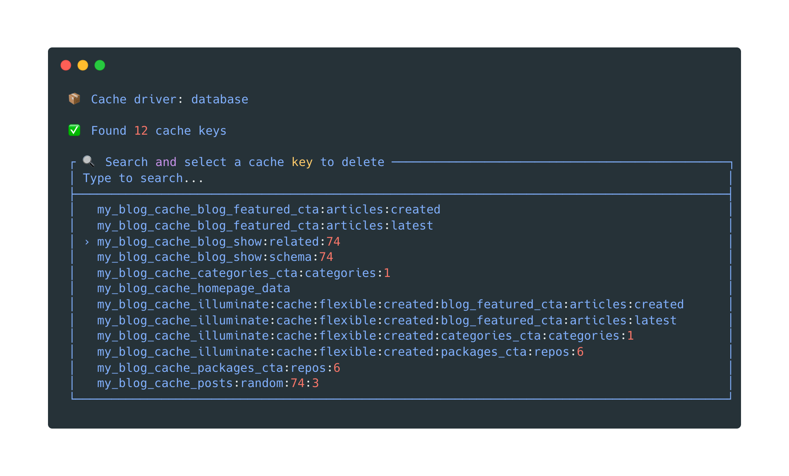

<picture>

</picture>

# Cache UI Laravel

[](https://packagist.org/packages/abr4xas/cache-ui-laravel)
[](https://github.com/abr4xas/cache-ui-laravel/actions?query=workflow%3Arun-tests+branch%3Amaster)
[](https://github.com/abr4xas/cache-ui-laravel/actions?query=workflow%3A"Fix+PHP+code+style+issues"+branch%3Amaster)
[](https://packagist.org/packages/abr4xas/cache-ui-laravel)

A Laravel package that allows you to list, search and delete individual cache keys without having to purge the entire cache. Supports multiple cache drivers (Redis, File, Database) with an interactive command line interface.

## Installation

You can install the package via composer:

```bash
composer require abr4xas/cache-ui-laravel
```

Optionally, you can publish the config file with:

```bash
php artisan vendor:publish --tag="cache-ui-laravel-config"
```

### Configuration

After publishing the config file, you can customize the package behavior:

```php
return [
    // Default cache store to use
    'default_store' => env('CACHE_UI_DEFAULT_STORE', null),

    // Character limit in value preview
    'preview_limit' => env('CACHE_UI_PREVIEW_LIMIT', 100),

    // Number of visible items in scroll
    'search_scroll' => env('CACHE_UI_SEARCH_SCROLL', 15),
];
```

You can also configure these values in your `.env` file:

```env
CACHE_UI_DEFAULT_STORE=redis
CACHE_UI_PREVIEW_LIMIT=150
CACHE_UI_SEARCH_SCROLL=20
```

### Custom File Cache Driver (Only for File Store)

If you are using the `file` cache driver (default in Laravel), you should use our custom `key-aware-file` driver.

**Why?** The standard Laravel `file` driver stores keys as hashes, making them unreadable. This custom driver wraps the value to store the real key, allowing you to see and search for them.

> **Important**: This is **NOT** needed for Redis or Database drivers, as they support listing keys natively.

#### Driver Configuration

1. **Add the custom store** to your `config/cache.php` file:

```php
// ... existing code ...

    'stores' => [

        // ... existing stores ...

        'file' => [
            'driver' => 'key-aware-file', // Changed from 'file' to 'key-aware-file'
            'path' => storage_path('framework/cache/data'),
            'lock_path' => storage_path('framework/cache/data'),
        ],

// ... existing code ...
```

2. **Register the custom driver** in your `AppServiceProvider`:

```php
<?php

namespace App\Providers;

use Abr4xas\CacheUiLaravel\KeyAwareFileStore;
use Illuminate\Support\Facades\Cache;
use Illuminate\Support\ServiceProvider;
use Illuminate\Foundation\Application;

class AppServiceProvider extends ServiceProvider
{
    /**
     * Register any application services.
     */
    public function register(): void
    {
        //
    }

    /**
     * Bootstrap any application services.
     */
    public function boot(): void
    {
        // Register the custom file cache driver
        Cache::extend('key-aware-file', fn (Application $app, array $config) => Cache::repository(new KeyAwareFileStore(
            $app['files'],
            $config['path'],
            $config['file_permission'] ?? null
        )));
    }
}
```

#### Custom Driver Benefits

- ✅ **Readable keys**: Shows real keys instead of file hashes
- ✅ **Full compatibility**: Works exactly like the standard `file` driver
- ✅ **Better experience**: Enables more intuitive cache key search and management
- ✅ **Backward compatibility**: Existing cache files continue to work

#### Migration from Standard File Driver

If you already have cached data with the standard `file` driver, don't worry. The `key-aware-file` driver is fully compatible and:

- Existing data will continue to work normally
- New keys will be stored in the new format
- You can migrate gradually without data loss


## Usage

### Basic Command

Run the command to list and manage cache keys:

```bash
php artisan cache:list
```

### Specify a Cache Store

If you have multiple cache stores configured, you can specify which one to use:

```bash
php artisan cache:list --store=redis
```

### Features

- 🔍 **Interactive search**: Search cache keys by typing text
- 📋 **List all keys**: View all available keys in your cache
- 🗑️ **Selective deletion**: Delete individual keys without affecting the rest of the cache
- 🔌 **Multiple drivers**: Supports Redis, File and Database

### Supported Drivers

| Driver | Support | Configuration Required |
|--------|---------|------------------------|
| **Redis** | ✅ Native | None (Works out of the box) |
| **Database** | ✅ Native | None (Works out of the box) |
| **File** | ✅ Enhanced | **Requires `key-aware-file` driver** |
| **Array** | ⚠️ No | Not supported (doesn't persist) |
| **Memcached** | ⚠️ No | Not currently supported |

> **Note**: The `key-aware-file` driver is **only** needed if you use the `file` cache driver. If you use Redis or Database, you don't need to change your driver configuration.

### Usage Example

```bash
$ php artisan cache:list

📦 Cache driver: redis
✅ Found 23 cache keys

🔍 Search and select a cache key to delete
> user_1_profile

📝 Key:     user_1_profile

Are you sure you want to delete this cache key? › No / Yes

🗑️  The key 'user_1_profile' has been successfully deleted
```

### Programmatic Usage (optional)

You can also use the `CacheUiLaravel` class directly in your code:

```php
use Abr4xas\CacheUiLaravel\Facades\CacheUiLaravel;

// Get all cache keys from default store
$keys = CacheUiLaravel::getAllKeys();

// Get all cache keys from a specific store
$redisKeys = CacheUiLaravel::getAllKeys('redis');

// Delete a specific key from default store
$deleted = CacheUiLaravel::forgetKey('user_1_profile');

// Delete a key from a specific store
$deleted = CacheUiLaravel::forgetKey('session_data', 'redis');
```

## Testing

```bash
composer test:unit
```

## TODO

The following tests need to be implemented to fully validate the new `KeyAwareFileStore` functionality:

### Unit Tests for KeyAwareFileStore
- [ ] Test `put()` method with various data types (string, integer, array, boolean, null)
- [ ] Test `get()` method with wrapped and unwrapped data formats
- [ ] Test `add()` method behavior and return values
- [ ] Test `forever()` method with zero expiration
- [ ] Test `increment()` method with numeric values
- [ ] Test backward compatibility with legacy cache files
- [ ] Test error handling for corrupted cache files
- [ ] Test file permissions and directory creation

### Integration Tests
- [ ] Test complete cache workflow (store → retrieve → delete)
- [ ] Test multiple keys with different expiration times
- [ ] Test cache key listing with `getAllKeys()` method
- [x] Test cache key deletion with `forgetKey()` method
- [ ] Test mixed wrapped and legacy data scenarios
- [ ] Test performance with large numbers of cache keys

### Driver Registration Tests
- [ ] Test custom driver registration in `AppServiceProvider`
- [ ] Test driver configuration with different file permissions
- [ ] Test driver fallback behavior with missing configuration
- [ ] Test driver isolation between different cache stores
- [ ] Test error handling for invalid paths and permissions

### CacheUiLaravel Integration Tests
- [ ] Test `getAllKeys()` method with `key-aware-file` driver
- [x] Test `forgetKey()` method with `key-aware-file` driver
- [ ] Test mixed driver scenarios (Redis + File + Database)
- [ ] Test error handling and graceful degradation

### Edge Cases and Error Handling
- [ ] Test with read-only file systems
- [ ] Test with insufficient disk space
- [ ] Test with invalid serialized data
- [ ] Test with very large cache values
- [ ] Test with special characters in cache keys

## Changelog

Please see [CHANGELOG](CHANGELOG.md) for more information on what has changed recently.

## Contributing

Please see [CONTRIBUTING](CONTRIBUTING.md) for details.

## Security Vulnerabilities

Please review [our security policy](../../security/policy) on how to report security vulnerabilities.

## Credits

- [Angel](https://github.com/abr4xas)
- [All Contributors](../../contributors)

## License

The MIT License (MIT). Please see [License File](LICENSE.md) for more information.
